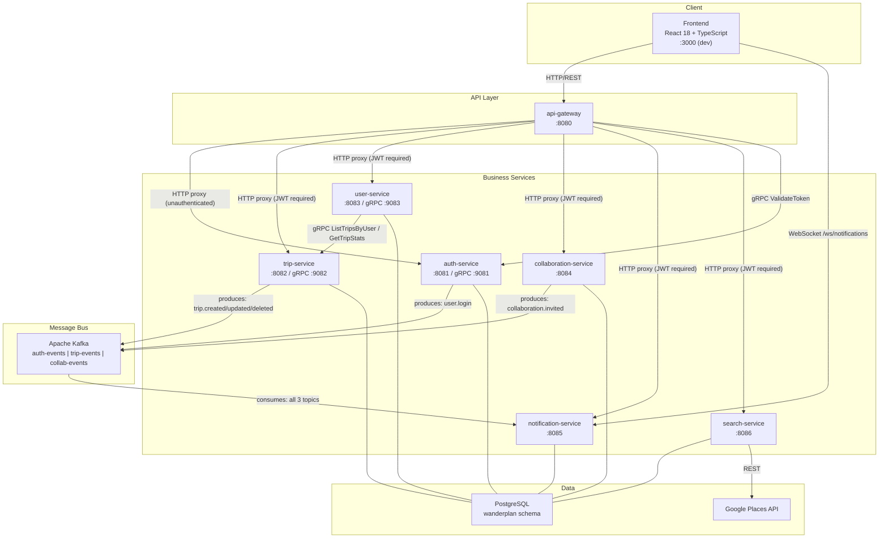
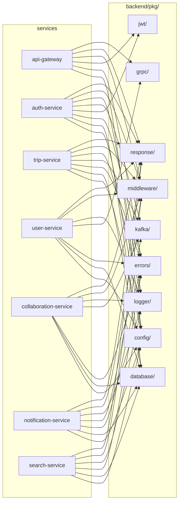

# WanderPlan — Architecture & Entity Relationship Graph

> **Maintenance rule**: Update this file whenever you add, remove, or rename a service, endpoint, Kafka topic, proto RPC, database table, or shared package. The section headings and Mermaid diagrams are the single source of truth for how every entity connects.

---

## System Overview

---

## Inter-Service Communication Map

### gRPC Calls

| Caller | Callee | Proto File | RPC | Purpose |
|--------|--------|------------|-----|---------|
| `api-gateway` | `auth-service` | `auth.proto` | `ValidateToken` | JWT validation on every request |
| `user-service` | `trip-service` | `trip.proto` | `ListTripsByUser` | Return trips for `/users/me/trips` |
| `user-service` | `trip-service` | `trip.proto` | `GetTripStats` | Dashboard stats for `/users/me/stats` |

### Kafka Event Flow

| Topic | Producer | Events Published | Consumer | Action on Consume |
|-------|----------|-----------------|----------|-------------------|
| `auth-events` | `auth-service` | `user.login` | `notification-service` | Create Notification record + WebSocket push |
| `trip-events` | `trip-service` | `trip.created`, `trip.updated`, `trip.deleted` | `notification-service` | Create Notification + push |
| `collab-events` | `collaboration-service` | `collaboration.invited` | `notification-service` | Create Notification + push |

### HTTP Proxy Rules (api-gateway)

| Path Pattern | Upstream | Auth Required |
|-------------|----------|---------------|
| `/auth/*` | `auth-service:8081` | No |
| `/api/v1/trips/*` | `trip-service:8082` | Yes (JWT) |
| `/api/v1/users/*` | `user-service:8083` | Yes (JWT) |
| `/api/v1/collaborators/*` | `collaboration-service:8084` | Yes (JWT) |
| `/api/v1/notifications/*` | `notification-service:8085` | Yes (JWT) |
| `/api/v1/search/*` | `search-service:8086` | Yes (JWT) |

---

## Database Table Ownership

| Table | Owner Service | Referenced By |
|-------|--------------|---------------|
| `users` | `auth-service` (write) | `user-service` (read), `collaboration-service` (read) |
| `refresh_tokens` | `auth-service` | — |
| `trips` | `trip-service` | `collaboration-service`, `search-service`, `user-service` (via gRPC) |
| `itinerary_days` | `trip-service` | — |
| `itinerary_items` | `trip-service` | — |
| `collaborators` | `collaboration-service` | — |
| `trip_tags` | `trip-service` | — |
| `notifications` | `notification-service` | — |
| `places_cache` | `search-service` | — |
| `audit_log` | shared (any service writes) | — |

---

## Shared Package Dependencies

---

## Proto File Dependency Map

| Proto File | Generated gRPC Server | Generated gRPC Client Used By |
|-----------|----------------------|-------------------------------|
| `wanderplan/v1/auth.proto` | `auth-service` | `api-gateway` |
| `wanderplan/v1/trip.proto` | `trip-service` | `user-service` |
| `wanderplan/v1/user.proto` | `user-service` | _(not called yet)_ |

---

## Frontend → Backend API Map

| Frontend Component / Hook | HTTP Method + Path | Backend Service |
|--------------------------|-------------------|-----------------|
| `Login.tsx` | `GET /auth/{provider}/login` | auth-service |
| `Signup.tsx` (callback) | `GET /auth/{provider}/callback` | auth-service |
| `api.ts` (refresh interceptor) | `POST /auth/refresh` | auth-service |
| `Header.tsx` logout | `POST /auth/logout` | auth-service |
| `Header.tsx` profile | `GET /auth/me` | auth-service |
| `Dashboard.tsx` stats | `GET /users/me/stats` | user-service → trip-service |
| `Trips.tsx` | `GET /trips` | trip-service |
| `TripDetail.tsx` load | `GET /trips/:id` | trip-service |
| `TripDetail.tsx` create | `POST /trips` | trip-service |
| `TripDetail.tsx` update | `PATCH /trips/:id` | trip-service |
| `TripDetail.tsx` delete | `DELETE /trips/:id` | trip-service |
| `TripDetail.tsx` add day | `POST /trips/:id/days` | trip-service |
| `TripDetail.tsx` add item | `POST /trips/:id/days/:dayId/items` | trip-service |
| `TripDetail.tsx` reorder | `PATCH /trips/:id/items/reorder` | trip-service |
| `TripDetail.tsx` collaborators | `GET /trips/:id/collaborators` | collaboration-service |
| `TripDetail.tsx` invite | `POST /trips/:id/collaborators` | collaboration-service |
| `Header.tsx` notifications | `GET /notifications` | notification-service |
| `Header.tsx` mark read | `PATCH /notifications/:id/read` | notification-service |
| `Header.tsx` WS | `WS /ws/notifications` | notification-service |
| `CityDetail.tsx` places | `GET /search/places?q=` | search-service |
| `TripDetail.tsx` autocomplete | `GET /search/places?q=&lat=&lng=` | search-service |
| `Dashboard.tsx` trip search | `GET /search/trips?q=` | search-service |

---

## File-Level Dependency Graph (per service)

See individual context documents in `docs/context/` for file-level relationships within each service.

- [api-gateway](context/api-gateway.md)
- [auth-service](context/auth-service.md)
- [trip-service](context/trip-service.md)
- [user-service](context/user-service.md)
- [collaboration-service](context/collaboration-service.md)
- [notification-service](context/notification-service.md)
- [search-service](context/search-service.md)
- [frontend](context/frontend.md)
- [shared packages](context/shared-packages.md)
